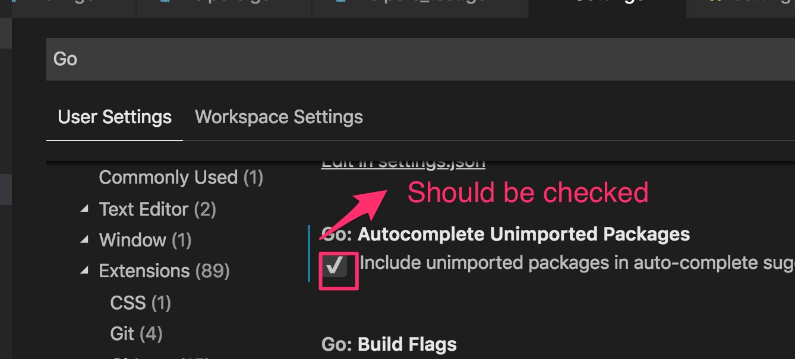
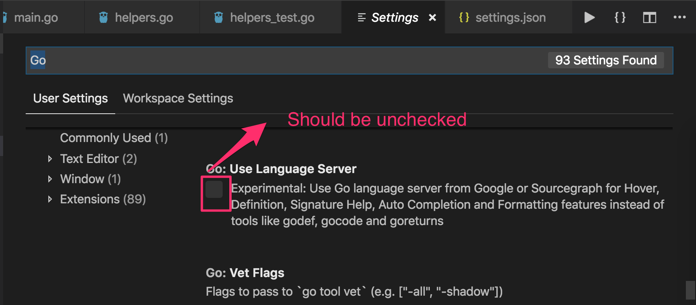

# Common Issues

## VSCode

### Go intellisense autocomplete stops working in VSCode

> Go intellisense autocomplete stops working in VSCode

Please do things below:

- gocode close
- gocode exit (just to make sure)
- Go: Install/Update Tools or install gocode go get -u github.com/mdempsky/gocode

Probably previously we missed the gocode close command. Not really sure. But hopefully works.

> If it still not work, please follow bellow to make sure you are correct some settings

1. Checked here



2. Unchecked here



## xcrun: error: active developer path (“/Applications/Xcode.app/Contents/Developer”) does not exist

To reset the developer's path:

```
$ sudo xcode-select --reset
```

https://stackoverflow.com/questions/35009531/xcrun-error-active-developer-path-applications-xcode-app-contents-developer
  