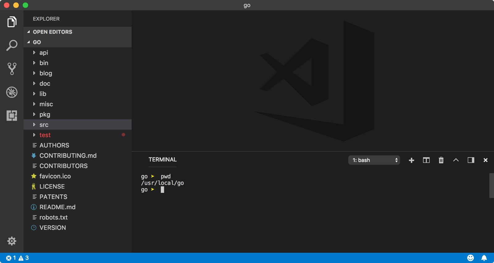
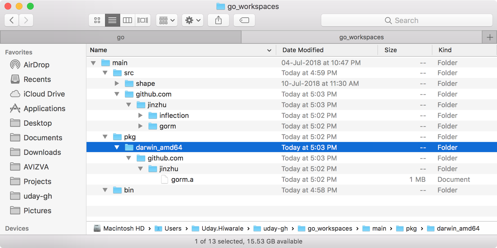
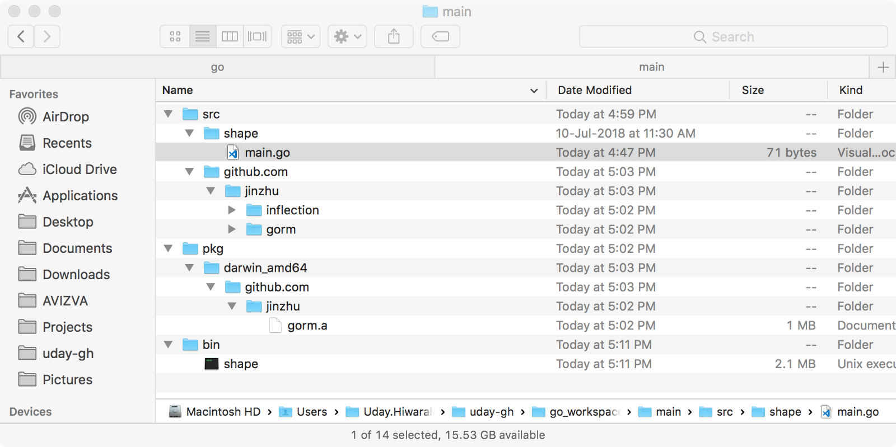
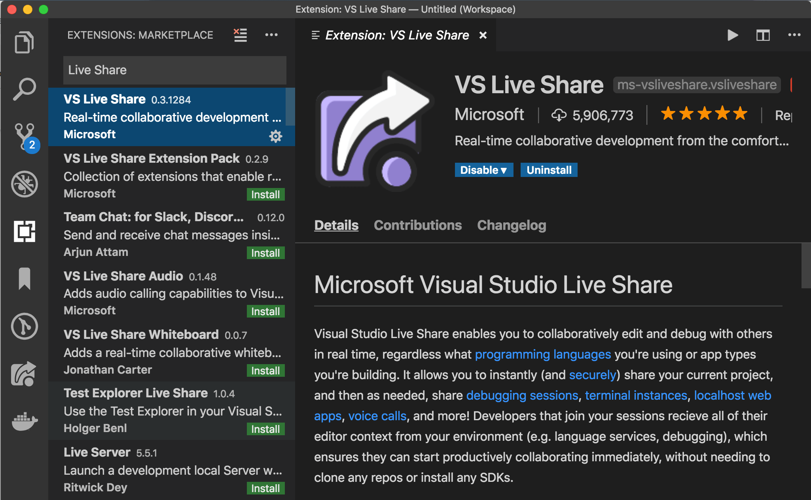

# Install Golang

As Go is open source and free, you can install it from the source. It also provides compiled binaries to install Go on your system with ease. It also comes with Windows Installer (msi) which I would recommend if you are using Windows. All other download and installation related information is available at https://golang.org/dl/.

## Go Installation Directory

When you install Go on your system, it creates a directory `/usr/local/go` in UNIX or `c:/go` in Windows. Then it copies all necessary code and binaries needed for Go to function in this directory. This is where Go’s **command line tools, standard library** and **compiler** lives. Whenever you import a package from Go’s standard library, Go looks for package in this directory.



## Custom Installation directory

If somehow, your Go installation directory is different than what Go assumes where it would be, you can use GOROOT environment variable. Edit your ~/.bash_profile and add below entry. For Windows, [follow this answer](https://superuser.com/questions/949560/how-do-i-set-system-environment-variables-in-windows-10).

```bash
export GOROOT=/usr/local/custom-go
```

> Generally, you don’t need to setup GOROOT environment variable. I recommend not to modify/use GOROOT variable anywhere unless it is absolutely necessary.

## Go Workspace

You can create a Go program anywhere you want on your system. A typical Go program is a plain text file with `.go` file extension. You can run this program using `go run hello.go` command where `hello.go` is a Go program file in current directory.

A `workspace` is Go’s way to facilitate project management. A workspace in nutshell, is a directory on your system where Go `looks for source code` files, **manages dependency packages** and **build distribution binary files**. Whenever Go program hits `import` statement, it looks for package(s) in Go’s **standard library** (`$GOROOT/src`). If package is not present there, then Go refers to system's environment variable GOPATH which is path to Go workspace directory and looks for packages in `$GOPATH/src` directory.

You can have as many workspaces as you want, as long as you keep GOPATH environment variable pointed to current working workspace directory.

> Similar to `$GOROOT, $GOPATH` by default points to `$HOME/go` directory in UNIX and `%USERPROFILE%\go` on windows. Hence, it is not absolutely necessary to setup `GOPATH` environment variable.

## Workspace directory structure

A Go workspace directory must have three sub directories viz. `src`, `pkg` and `bin`. If you want to setup Go workspace, follow [this](https://golang.org/doc/code.html#Workspaces) documentation. If you are using MacOS, the you can follow [this](https://medium.com/@himanshuagarwal1395/setting-up-environment-variables-in-macos-sierra-f5978369b255) Medium article to setup environment variables both temporarily or permanently.


### src

`src` directory contains packages. A package in nutshell is a project directory containing Go source code (`.go` files). Any packages installed using `go get` command will reside here as well (*and its dependency packages*).

In Go, every program is contained in a package. Hence, whenever you will be working with new Go project, you need to create new directory inside `$GOPATH/src` and work your way up there.

### pkg

`pkg` directory contains Go package objects. They are compiled version of original package source code and they have `.a` file extension (**a** stands for **archived**). These files contain the compiled package binary code, along with debug symbols and source information. A package object is **customized for machine architecture and Go version**. These files are created by the Go [pack](https://golang.org/cmd/pack/) tool while building/installing a package.

Whenever you install a 3rd party package, a package object `package-name.a` is created for that package in this directory.

In Go, you typically use `import "<package-name>"` or `import "<main/child-package>"` syntax to import a package (like ES6 syntax). Normally, Go looks for these packages in `$GOROOT/src` or `$GOPATH/src` directories. But if it finds precompiled package object associated with an imported package, then Go uses that instead.

Package objects are compiled and archived files for specific platforms. Hence you will see platform `architecture directory` inside `pkg` directory.


Advantage of having package object is to save compilation time. As a package is nothing but collection of Go programs, it has to go through Go compiler every single time main program (*a program who imports it*) compiles. If a package has compiled object in **pkg** directory for current system architecture, then it doesn’t get compiled again.

Therefore when you are referencing `foo/bar` package. It refers to `$GOPATH/pkg/{arch}/foo/bar.a` and not `$GOPATH/src/foo/bar/*.go` (*for Go’s standard library package, it will be `$GOROOT` instead of `$GOPATH`*).

> A package object is created when you use `go install` command on **non-main** packages. You will learn about **main** and **non-main** packages in packages lesson. Package object are also called as cached objects or cached packages.

### bin

A Go program can either be meant to used as `utility inside a package` or to `perform some operation`. We have seen packages and where they reside.

A Go program which is meant to perform some operation like **make a network request** or **write something to a file** needs to be compiled first, so that your machine can understand the instructions. When you run go run `hello.go` command, Go compiler first compiled `hello.go` file and then executes the resultant binary code.

You can output a binary file from a Go program or package using `go build <package-name>` (*main package*) or `go build program/path.go` command. This will create a binary file in current directory.


**bin** directory contains same binary executable files. These files are creating by `go install` commands. `go install` command runs go build command internally and output theses files to **bin** directory. Generally, this directory is in the executable path of the system. Hence all the programs inside this directory is executable from the terminal.

> `go install` command also creates **package objects** of any imported packages inside currently compiling Go program. Learn more about `go build` vs `go install` commands from [here](https://pocketgophers.com/go-install-vs-go-build/).


> `GOBIN` is another environment variable that Go uses to put binary files created using `go install` command. By default, `GOBIN` is `$GOPATH/bin` but you can change it to whatever directory you like.

## Summing Up

Motivation behind having a Go workspace is to easily manage you projects, dependencies and distributions. Switching Go workspaces should be easy, hence I generally create one Go workspace per project and temporarily set `$GOPATH` environment variable to quickly change workspaces.

### 1. Set up environment variables

```bash
export GOPATH=/Users/Uday.Hiwarale/uday-gh/go_workspaces/main
export GOBIN=$GOPATH/bin

PATH=$PATH:$GOPATH:$GOBIN
export PATH
```

Setting `GOBIN` environment variable is not necessary, but since bin directory of a workspace will be in our `PATH`, it’s good idea set it for simplicity.

### 2. Make sure, $GOPATH and $GOBIN is set


As discussed, there is no need to set `GOROOT` environment variables as we are using default installation directory (*on macOS = `/usr/local/go`*).

### 3. Installing 3rd party package


This command will pull source from GitHub repository and put it inside `$GOPATH/src`. This will also download other dependency packages of `gorm` and install under `src` directory.



After package and dependencies are downloaded, Go will compile package and create single package object file in `$GOPATH/pkg` directory under same directory structure of package.

### 4. Create binaries




It doesn’t matter, from where you execute `go install shape` command, Go knows where `shape` package is (*from `GOPATH` environment variable*). Hence, a binary file is generate inside `bin` directory. Since, this `bin` directory is in our PATH, we can execute these binary file just by it’s `filename as command`.

# Setting up Visual Studio Code

Getting up and running with Visual Studio Code is quick and easy. It is a small download so you can install in a matter of minutes and give VS Code a try.

## Cross platform

VS Code is a free code editor which runs on the macOS, 

Linux and Windows operating systems.

- [macOS](https://code.visualstudio.com/docs/setup/mac)
- [Linux](https://code.visualstudio.com/docs/setup/linux)
- [Windows](https://code.visualstudio.com/docs/setup/windows)

VS Code is lightweight and should run on most available hardware and platform versions. You can review the [System Requirements](https://code.visualstudio.com/docs/supporting/requirements) to check if your computer configuration is supported.

## Install Go Extension


## Install VS Live Share Extension



## Install Go Path Extension

## Setup Go Module with VSCode

> We should not enable `GO111MODULE=on` globally, due to there are many project'r still using old version.

**.vscode/launch.json**

```json
{
    "version": "0.2.0",
    "configurations": [
        {
            "name": "Launch",
            "type": "go",
            "request": "launch",
            "mode": "auto",
            "program": "${workspaceFolder}/main.go",
            "env": {
                "GO111MODULE": "on"
            },
            "args": []
        }
    ]
}
```

**settings.json**

```json
{
    "go.testEnvVars": {
        "GO111MODULE": "on"
    }
}
```
# Reference and credit

- https://medium.com/rungo/working-in-go-workspace-3b0576e0534a
- https://golang.org/doc/install
- https://superuser.com/questions/949560/how-do-i-set-system-environment-variables-in-windows-10