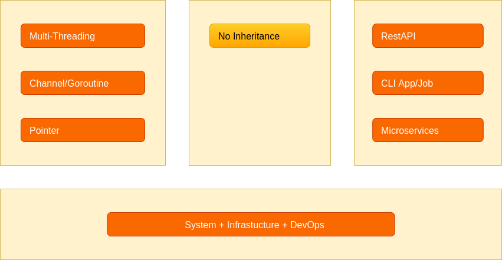
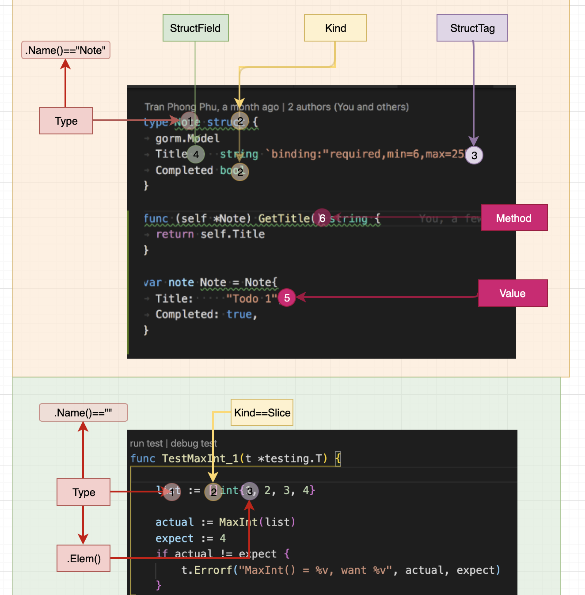

# Week 1 Keynote - Gettings started with Go

<!-- @import "[TOC]" {cmd="toc" depthFrom=2 depthTo=6 orderedList=false} -->

<!-- code_chunk_output -->

- [Overview](#overview)
  - [Why](#why)
  - [What is Go good for](#what-is-go-good-for)
  - [Golang in Github](#golang-in-github)
  - [Top Go Projects](#top-go-projects)
  - [Some source to learn golang](#some-source-to-learn-golang)
  - [Big name in Viet Nam using Golang](#big-name-in-viet-nam-using-golang)
- [Set up environments & code organization](#set-up-environments-code-organization)
  - [Set up env](#set-up-env)
  - [Go project structure](#go-project-structure)
- [An Introduction to Programming with Go and TDD](#an-introduction-to-programming-with-go-and-tdd)
- [Go characteristics and principles](#go-characteristics-and-principles)
- [How Go runs in single CPU and multiple CPUs](#how-go-runs-in-single-cpu-and-multiple-cpus)
- [Go examples](#go-examples)
- [Reflection and Go's reflect package](#reflection-and-gos-reflect-package)
- [Practising TDD methodology](#practising-tdd-methodology)
  - [Exercise 1: implement Singleton Pattern with Go](#exercise-1-implement-singleton-pattern-with-go)
  - [Exercise 2: convert CSV to YAML using pointer](#exercise-2-convert-csv-to-yaml-using-pointer)
  - [Exercise 3 (Home work): clone Lodash/Underscore to deep dive into Go](#exercise-3-home-work-clone-lodashunderscore-to-deep-dive-into-go)
- [Challenges](#challenges)
  - [Challenge 1: implement `pool connection pattern`](#challenge-1-implement-pool-connection-pattern)
  - [Challenge 2: Finding Max Square](#challenge-2-finding-max-square)

<!-- /code_chunk_output -->

## Overview

> Overview on the fastest growing language and why we should learn Golang

### Why

- fast (for human and for machine)
- simple
- concurrency

### What is Go good for

Golang is a multipurpose language

- Web server
- Command line
- System
- Infrastructure/DevOps (Ex: Docker, K8s)

> Cloud Native Landscape https://github.com/cncf/landscape

### Golang in Github

- https://github.com/golang/go
- https://github.com/avelino/awesome-go
- https://github.com/Alikhll/golang-developer-roadmap
- https://github.com/topics/go
- https://golang.org/doc/effective_go.html

### Top Go Projects

- https://github.com/kubernetes/kubernetes - 52k★
- https://github.com/grafana/grafana - 28k★
- https://github.com/etcd-io/etcd - 24k★
- https://github.com/hashicorp/terraform - 16k★
- https://github.com/hashicorp/consul - 15k★
- https://github.com/elastic/beats - 7k★
- https://github.com/TykTechnologies/tyk - 4k★

### Some source to learn golang

- https://tour.golang.org/
- https://blog.golang.org/
- https://gobyexample.com/
- https://github.com/gothinkster/realworld

### Big name in Viet Nam using Golang

- Teko
- Sendo
- Chotot
- Grab
- GoViet (GoJek), ...

## Set up environments & code organization

### Set up env

- https://play.golang.org/
- https://golang.org/doc/install
- Set up GOPATH, GOROOT, GOBIN

### Go project structure

- Go programmers typically keep all their Go code in a single workspace.
- A workspace contains many version control repositories (managed by Git, - for example).
- Each repository contains one or more packages.
- Each package consists of one or more Go source files in a single directory.
- The path to a package's directory determines its import path.

## An Introduction to Programming with Go and TDD

> Exercise:
> https://github.com/quii/learn-go-with-tests

## Go characteristics and principles



## How Go runs in single CPU and multiple CPUs

**Working with Race Condition - Understanding Thread Safe**

<details>
 <summary>Source code</summary>

```go
package main

import (
  "fmt"
)

func main() {
  fmt.Println("------------------")
  m := make(map[string]string)
  go func() {
    m["1"] = "a" // First conflicting access.
  }()
  m["2"] = "b" // Second conflicting access.
  for k, v := range m {
    fmt.Println(k, v)
  }
}
```

</details>

```sh
$ go build -o race1 race1.go && for i in {1..100}; do ./race1; done;
$ go build -o race1 race1.go && for i in {1..100}; do ./race1 >> race1.txt; done;
```

## Go examples

- Hello World
- Basic Types
- Variables
- Constants
- Arrays
- Slices
- Maps
- For
- If/else
- Switch
- Functions
- Pointer
- Struct
- Method
- Interface
- Error handling

## Reflection and Go's reflect package

> Why? Learn Go language to uderstand how most common libs such as json, yaml, orm that work.



## Practising TDD methodology

### Exercise 1: implement Singleton Pattern with Go

**The Common Mistake**

```go
package singleton

type singleton struct {
}

var instance *singleton

func GetInstance() *singleton {
  if instance == nil {
    instance = &singleton{}   // <--- NOT THREAD SAFE
  }
  return instance
}
```

**The Aggressive Locking**

<details>
 <summary>Source code</summary>

```go
var mu Sync.Mutex

func GetInstance() *singleton {
  mu.Lock() // <--- Unnecessary locking if instance already created
  defer mu.Unlock()

  if instance == nil {
    instance = &singleton{}
  }
  return instance
}
```

</details>

**Better version 1**

<details>
 <summary>Source code</summary>

```go
func GetInstance() *singleton {
  if instance == nil {
    mu.Lock()
    defer mu.Unlock()

    if instance == nil {
      instance = &singleton{}
    }
  }
  return instance
}
```

</details>

**Better version 2**

<details>
 <summary>Source code</summary>

```go
import "sync"
import "sync/atomic"

var initialized uint32

func GetInstance() *singleton {
  if atomic.LoadUInt32(&initialized) == 1 {
    return instance
  }
  mu.Lock()
  defer mu.Unlock()
  if initialized == 0 {
    instance = &singleton{}
    atomic.StoreUint32(&initialized, 1)
  }
  return instance
}
```

</details>

**Go team implement `sync` package**

<details>
 <summary>Source code</summary>

```go
// Once is an object that will perform exactly one action.
type Once struct {
  m    Mutex
  done uint32
}

func (o *Once) Do(f func()) {
  if atomic.LoadUint32(&o.done) == 1 { // <-- Check
    return
  }
  // Slow-path.
  o.m.Lock()                           // <-- Lock
  defer o.m.Unlock()
  if o.done == 0 {                     // <-- Check
    defer atomic.StoreUint32(&o.done, 1)
    f()
  }
}
```

</details>

**Final Version**

<details>
 <summary>Source code</summary>

```go
package singleton

import (
  "sync"
)

type singleton struct {
}

var instance *singleton
var once sync.Once

func GetInstance() *singleton {
  once.Do(func() {
    instance = &singleton{}
  })
  return instance
}
```

</details>

**Bonus: Java version**

<details>
 <summary>Source code</summary>

```java
public class MySinglton {
  private MySinglton (){}
  private static volatile MySinglton instance;
  public static MySinglton getInstance(){
   if (instance != null ) return instance;
    synchronized(MySinglton.class){
      if (instance == null ) {
        instance = new MySinglton();
      }
    }
    return instance;
  }
}
```

</details>

### Exercise 2: convert CSV to YAML using pointer

> Why need this exercise? Learn to use pointer.

<details>
 <summary>Source code</summary>

```go
package main

import (
	"bufio"
	"fmt"
	"io"
	"os"
	"strconv"
	"strings"

	yaml "gopkg.in/yaml.v2"
)

type Ward struct {
	Id      int    `yaml:"id"`
	Name    string `yaml:"name"`
	Deleted bool   `yaml:"deleted,omitempty"`
}

type District struct {
	Id      int     `yaml:"id"`
	Name    string  `yaml:"name"`
	Deleted bool    `yaml:"deleted,omitempty"`
	Wards   []*Ward `yaml:"wards"`
}

type Region struct {
	Id        int         `yaml:"id"`
	Name      string      `yaml:"name"`
	Deleted   bool        `yaml:"deleted,omitempty"`
	Districts []*District `yaml:"districts"`
}

var mapRegion map[int]*Region = map[int]*Region{}
var mapDistrict map[int]*District = map[int]*District{}

func convertCSVToYAML(fn string) (data []*Region, err error) {
	file, err := os.Open(fn)
	defer file.Close()

	if err != nil {
		return nil, err
	}

	reader := bufio.NewReader(file)
	for {
		line, err := reader.ReadString('\n')
		if err != nil {
			break
		}
		parts := strings.Split(line, ",")
		if len(parts) < 6 {
			panic("Line is not correct | data: " + line)
		}
		if parts[0] == "" || parts[0] == "Tỉnh Thành Phố" {
			continue
		}
		regionId, _ := strconv.Atoi(parts[1])
		regionName := parts[0]
		districtId, _ := strconv.Atoi(parts[3])
		districtName := parts[2]
		wardId, _ := strconv.Atoi(parts[5])
		wardName := parts[4]
		region, ok := mapRegion[regionId]
		if !ok {
			region = &Region{
				Id:   regionId,
				Name: regionName,
			}
			mapRegion[regionId] = region
			data = append(data, region)
		}
		district, ok := mapDistrict[districtId]
		if !ok {
			district = &District{
				Id:   districtId,
				Name: districtName,
			}
			mapDistrict[districtId] = district
			region.Districts = append(region.Districts, district)
		}

		ward := &Ward{
			Id:   wardId,
			Name: wardName,
		}
		district.Wards = append(district.Wards, ward)
	}

	if err != io.EOF {
		fmt.Printf(" > Failed!: %v\n", err)
	}

	return data, nil
}

func main() {
	file := "./data.csv"
	regions, _ := convertCSVToYAML(file)
	data, err := yaml.Marshal(&regions)
	if err != nil {
		fmt.Println(err)
	}
	fmt.Println(string(data))
}
```

</details>

### Exercise 3 (Home work): clone Lodash/Underscore to deep dive into Go

> Requirements: You should follow TDD to do this exercise.

- **IsEmpty**

- **Last**

- **Map**

- **Contains**

- **Max**

## Challenges

### Challenge 1: implement `pool connection pattern`

> Hint: You can refer `redis pool connect package`.

### Challenge 2: Finding Max Square

Have the function MaximalSquare(strArr) take the strArr parameter being passed which will be a 2D matrix of 0 and 1's, and determine the area of the largest square submatrix that contains all 1's. A square submatrix is one of equal width and height, and your program should return the area of the largest submatrix that contains only 1's. For example: if strArr is ["10100", "10111", "11111", "10010"] then this looks like the following matrix:

```
  1 0 1 0 0
  1 0 1 1 1
  1 1 1 1 1
  1 0 0 1 0
```

For the input above, you can see the bolded 1's create the largest square submatrix of size 2x2, so your program should return the area which is 4. You can assume the input will not be empty.

**Sample Test Cases**

**Case 1**

Input:["0111", "1111", "1111", "1111"]

Output:9

**Case 2**

Input:["0111", "1101", "0111"]

Output:1
