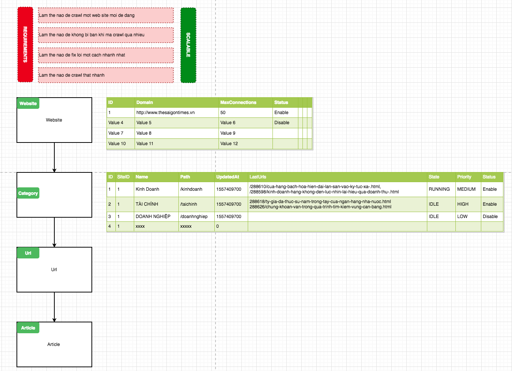
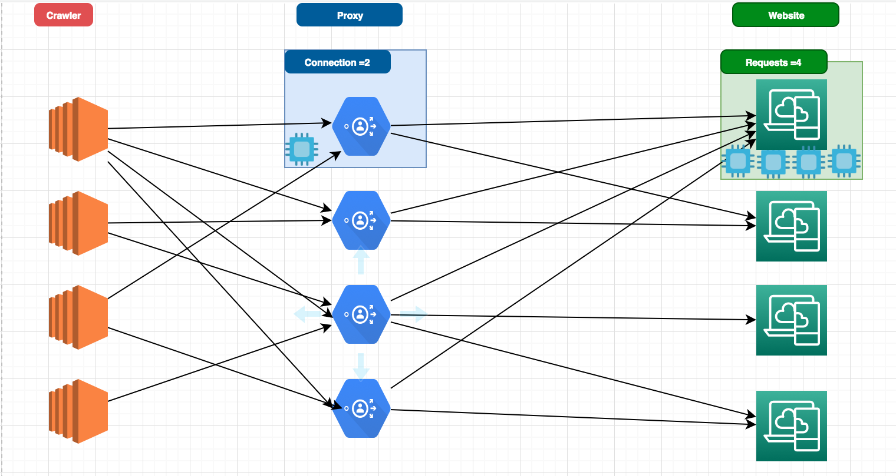
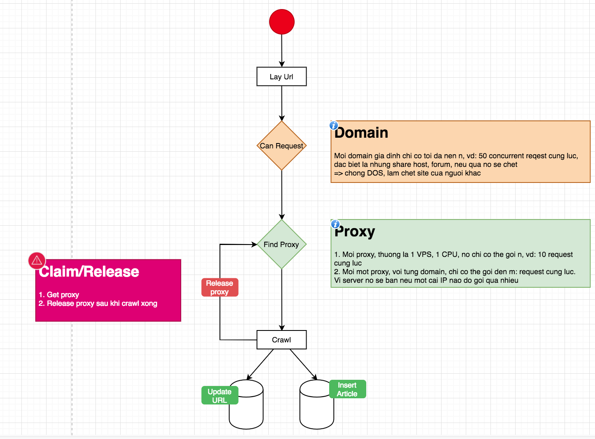

# Exercise

We will consider to build a crawler using Golang

# Most features

- Design Database for two missions: (1) to store crawled info/data, (2) to monitor/analyze/alert if software does not not work normally.
- Design a crawler which is easy to scale
- Plugin/Extension/Add-on architect to attach new site quickly without downtime
- Avoid to be banned.

# Key features

## Viet mot crawler
> De bo sung them mot website mot cach de dang

## Xu ly o duoi dang pipeline

> Xu ly dong thoi 3 nghiep vu:
1. Doc du lieu (url) can crawl tu db
1.1 Tai sao khong lam theo offset va limit. Khi db lon minh, offset ma lon nhu 1M la cau query sai
1.2 La luon order by theo id va lay nhung phan tu lon hon cai lan cuoi lay ra

```sql
SELECT * 
FROM url 
WHERE status = 1 AND state = 1 AND id > 30 
ORDER BY id ASC 
LIMIT 10 OFFSET 0
```
1.3 De lock lai cai du lieu khong co thang khac query trung, thi minh lock row db
```sql
SELECT FOR UPDATE * 
FROM url 
WHERE status = 1 AND state = 1 AND id > 30 
ORDER BY id ASC 
LIMIT 10 OFFSET 0
```

```sql
UPDATE url
SET state = 2
WHERE id IN (1, 2, 3, 4, 5)
LIMIT 5
```


1.4 Co mot giai phap khac la sharing theo application

- id % 10 = 0 may so 1
- id % 10 = 1 may so 2
- id % 10 = 2 may so 3

```sql
SELECT * 
FROM url 
WHERE status = 1 AND state = 1 AND id > 30 and routing = 1
ORDER BY id ASC 
LIMIT 10 OFFSET 0
```

1. (a) Download noi dung html tu url va parse no ra. (b) neu parse bi loi thi` mark du lieu cua buoc 1 la loi.
2. (a) Insert noi dung parse dc vao db. (b) Cap nhat cai url tu buoc 1 la DONE
3.1. La doi co du n article moi insert 1 lan (gia su 5)
3.1. Sau thoi gian 3 giay, thi van insert

## Chien luoc de monitor cai script cua minh
> Vi buoc 2 cac nghiep vu pipeline la can monitor out/in co hop ly hay khong?
> Neu no khong hop ly thi la code co van de.

Vi du:

- Minh goi ra ngoai la 100 request => ma hien tai no tra ve co 50 => 50 cai dang pending.
- Luc do minh chi can bo sung them 50 cai nua thoi.

## Database Design

## Software scaling

## Plugin architect

## Dynamic and smart proxy usage

