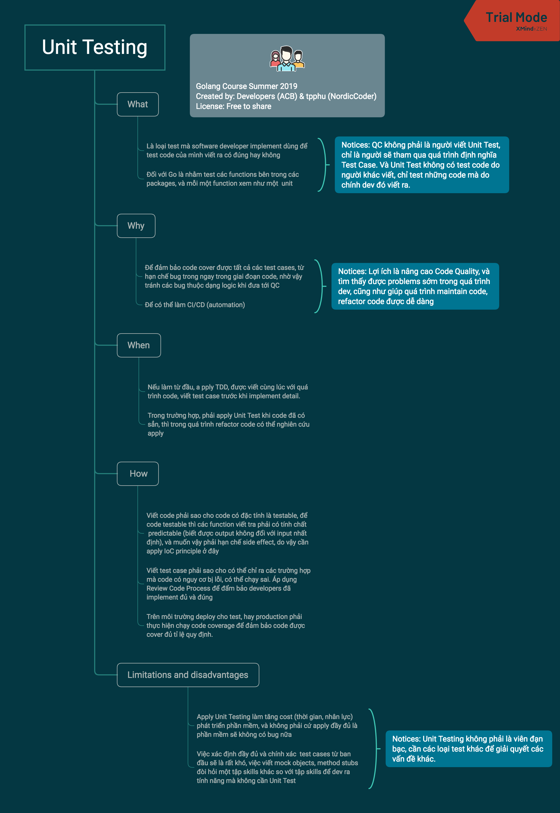
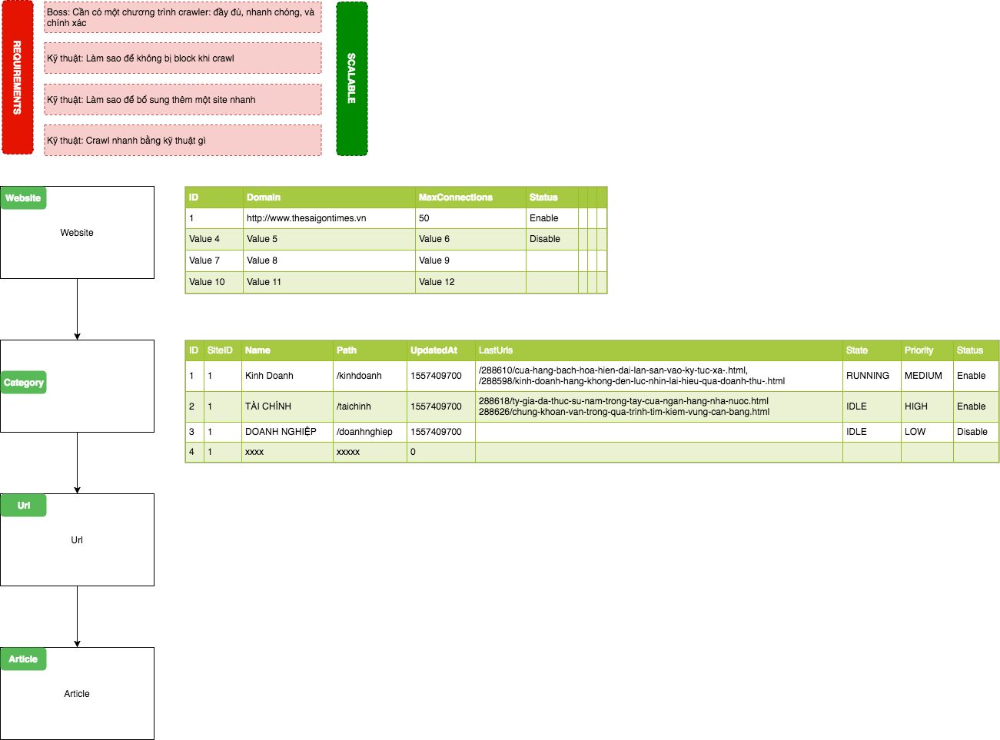
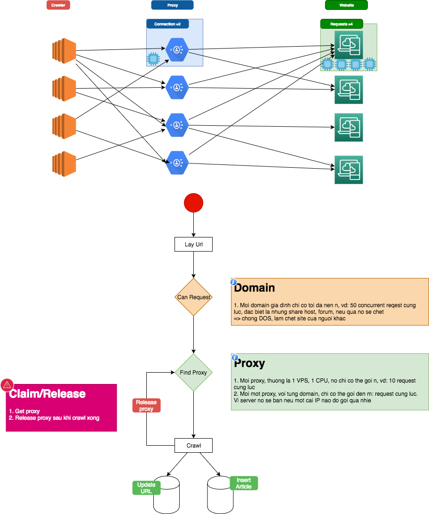

# Week 2 Keynotes - Pipe & Filter Pattern with Golang

- [Week 2 Keynotes - Pipe & Filter Pattern with Golang](#Week-2-Keynotes---Pipe--Filter-Pattern-with-Golang)
  - [Week 1 Review](#Week-1-Review)
    - [Unit Testing](#Unit-Testing)
    - [TDD](#TDD)
    - [Reflection](#Reflection)
  - [Pointer in Go](#Pointer-in-Go)
  - [Discover goroutines, channel, defer, panic, recover](#Discover-goroutines-channel-defer-panic-recover)
    - [Concurrency model](#Concurrency-model)
    - [Working with Goroutines](#Working-with-Goroutines)
    - [Working with Channels](#Working-with-Channels)
    - [Deferred Functions Calls](#Deferred-Functions-Calls)
    - [Panic and Recover](#Panic-and-Recover)
  - [Error handling in Go](#Error-handling-in-Go)
  - [Working with database/mysql](#Working-with-databasemysql)
  - [Pipeline programming in Go](#Pipeline-programming-in-Go)
    - [Diving into Golang by designing a scripting/job](#Diving-into-Golang-by-designing-a-scriptingjob)
    - [Strategy to watch scripting/job](#Strategy-to-watch-scriptingjob)
  - [Exercise: building a crawler](#Exercise-building-a-crawler)
    - [Analyze how to build a crawler (scrapy)](#Analyze-how-to-build-a-crawler-scrapy)
    - [Guide to setting up Docker/Laradock to install MySQL](#Guide-to-setting-up-DockerLaradock-to-install-MySQL)
    - [Following TDD and HTTP mock test](#Following-TDD-and-HTTP-mock-test)

## Week 1 Review

### Unit Testing

> Hint: Từng nhóm phát biểu (what & why & when & how) và note vào, có tính điểm.



### TDD

> Hint: Từng nhóm phát biểu (what & why & when & how) và note vào, có tính điểm.

### Reflection

> Hint: Từng nhóm phát biểu (what & why & when & how) và note vào, có tính điểm.

## Pointer in Go

- **Java**

<details>
 <summary>Source code</summary>

```java
class Point {
  int x = 0;
  int y = 0;
  public Point(int x, int y) {
    this.x = x;
    this.y = y;
  }
}
class Main {
  public static void main(String[] args) {
    Point p1 = new Point(10, 11);
    System.out.println("[x = "+p1.x +",y="+ p1.y+"]");
    Point p2 = p1;
    p2.x = -9;
    System.out.println("[x = "+p1.x +",y="+ p1.y+"]");
  }
}
```

</details>

- **PHP**

<details>
 <summary>Source code</summary>

```php
<?php

class Point {
  var $x = 0;
  var $y = 0;

  public function __construct($x, $y){
    $this->x = $x;
    $this->y = $y;
  }
}

$p1 = new Point(10, 11);

var_dump($p1);

$p2 = $p1;
$p2->x = -9;

var_dump($p1);
```

</details>

- **Nodejs**

<details>
 <summary>Source code</summary>

```go
function Point(x, y) {
  this.x = x;
  this.y = y;
}

var p1 = new Point(10, 11);

console.log(p1);

var p2 = p1;
p2.x = -9;

console.log(p1)
```

</details>

- **Go**

<details>
 <summary>Source code</summary>

```go
package main

import "fmt"

type Point struct {
  X int
  Y int
}

func main() {
  p1 := Point{10, 11}
  fmt.Println(p1)

  p2 := p1
  p2.X = -9

  fmt.Println(p1)
}
```

</details>

## Discover goroutines, channel, defer, panic, recover

### Concurrency model

1. Go uses the concurrency model called Communicating Sequential Processes (CSP)
2. The parts(threads) of an application(process) that run concurrently are called goroutines in Go

### Working with Goroutines

- See example: concurrency-goroutines-await

**References:**

- https://morsmachine.dk/go-scheduler
- https://speakerdeck.com/retervision/go-runtime-scheduler
- https://www.ardanlabs.com/blog/2018/08/scheduling-in-go-part1.html

### Working with Channels

- See example: gorountine-pipline

### Deferred Functions Calls

- See example: concurrency-goroutines-await

### Panic and Recover

- See doc: [Panic and Recover](02.-Week-2-Golang-Basic-3#panic-and-recover)

## Error handling in Go

If you have written any Go code you have probably encountered the built-in error type. Go code uses error values to indicate an abnormal state. For example, the os.Open function returns a non-nil error value when it fails to open a file.

```go
func Open(name string) (file *File, err error)
```

The following code uses os.Open to open a file. If an error occurs it calls log.Fatal to print the error message and stop.

```go
f, err := os.Open("filename.ext")
if err != nil {
  log.Fatal(err)
}
// do something with the open \*File f
```

You can get a lot done in Go knowing just this about the error type, but in this article we'll take a closer look at error and discuss some good practices for error handling in Go.

> See more: https://blog.golang.org/error-handling-and-go

## Working with database/mysql

## Pipeline programming in Go


### Diving into Golang by designing a scripting/job

### Strategy to watch scripting/job

## Exercise: building a crawler

### Analyze how to build a crawler (scrapy)





### Guide to setting up Docker/Laradock to install MySQL

### Following TDD and HTTP mock test
