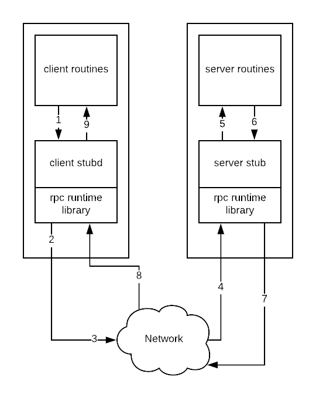
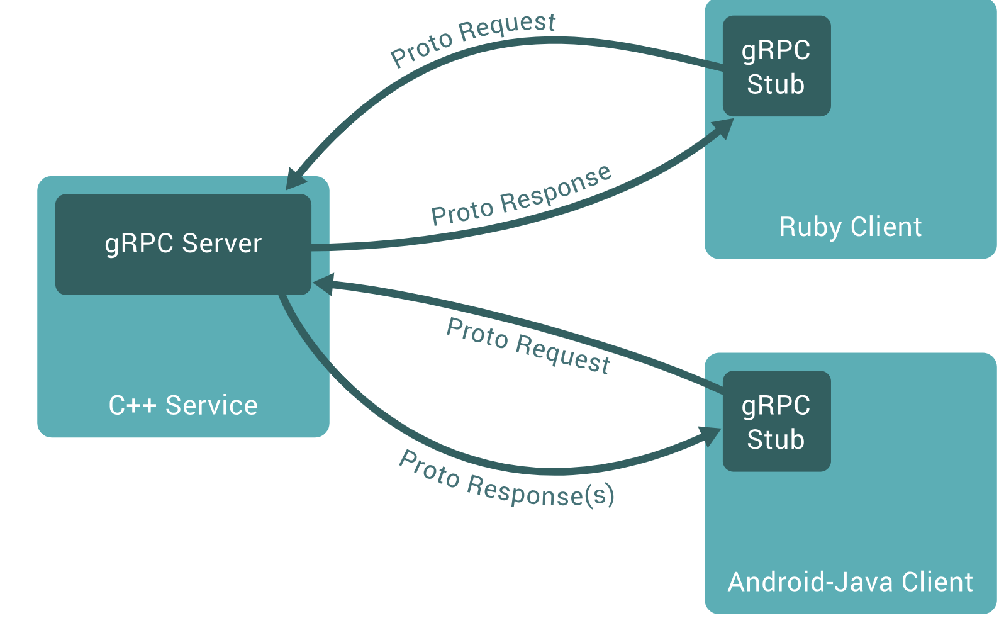

# Week 4 - Keynotes

## Working with Nginx Load Balander

1. **Set up `/etc/hosts`**

```
127.0.0.1 api.dev.local
```

2. Setup `nginx` inside Laradock/Docker

```
upstream api {
  server host.docker.internal:8081 weight=2;
  server host.docker.internal:8082 weight=1;
}

server {
  listen 80;
  listen [::]:80;
  server_name api.dev.local;
  location / {
    proxy_set_header   X-Forwarded-For $remote_addr;
    proxy_set_header   X-Scheme $scheme;
    proxy_set_header   Host $http_host;
    proxy_pass http://api;
  }
}
```
3. Start app

- For first instance: `PORT=8081 go run main.go`
- For second instance: `PORT=8082 go run main.go`

4. Test

```bash
$ curl api.dev.local/ping
$ curl api.dev.local/ping
$ curl api.dev.local/ping
```

You should see two output:

```
Pong from  1st server!
Pong from  1st server!
Pong from  2nd server!
```

and them repeated `Pong from  1st server!` is double `Pong from  2nd server!`

## RPC

Before we jump into gRPC let’s understand how remote procedure call works .



- A client application makes a local procedure call to the client stub containing the parameters to be passed on to the server.The server run-time library receives the request and calls the server stub procedure which unmarshalls (unpacks) the passed parameters and calls the actual procedure.
- The client stub serializes the parameters through a process called marshalling forwards the request to the local client-time library in the local computer which forwards the request to the server stub.
- The server stub sends back a response to the client-stub in the same fashion, a point at which the client resumes normal execution.

## gRPC

- RPC means: Remote Procedure Calls
- gRPC: A high-performance, open-source universal RPC framework
- By default gRPC uses protocol buffers



### Install Protobuf & Golang Protobuf

#### Mac OS X

If you have Homebrew (which you can get from https://brew.sh), just run:

```sh
brew install protobuf
```

If you see any error messages, run brew doctor, follow any recommended fixes, and try again. If it still fails, try instead:

```sh
brew upgrade protobuf
```

Alternately, run the following commands:

```sh
PROTOC_ZIP=protoc-3.7.1-osx-x86_64.zip
curl -OL https://github.com/protocolbuffers/protobuf/releases/download/v3.7.1/$PROTOC_ZIP
sudo unzip -o $PROTOC_ZIP -d /usr/local bin/protoc
sudo unzip -o $PROTOC_ZIP -d /usr/local 'include/*'
rm -f $PROTOC_ZIP
```

#### Linux

Run the following commands:

```sh
PROTOC_ZIP=protoc-3.7.1-linux-x86_64.zip
curl -OL https://github.com/protocolbuffers/protobuf/releases/download/v3.7.1/$PROTOC_ZIP
sudo unzip -o $PROTOC_ZIP -d /usr/local bin/protoc
sudo unzip -o $PROTOC_ZIP -d /usr/local 'include/*'
rm -f $PROTOC_ZIP
```

Alternately, manually download and install protoc from [here](https://developers.google.com/protocol-buffers/).

#### Golang Protobuf

```
https://github.com/golang/protobuf
https://github.com/grpc-ecosystem/grpc-gateway
```


### Coding Note service using gRPC

- **Define proto**

```proto
service NoteService {
  rpc Create(NoteReq) returns (Note) {}
  rpc Find(NoteFindReq) returns (Note) {}
}

message Note {
  int32 id = 1;
  string title = 2;
  string completed = 3;
  google.protobuf.Timestamp created_at = 4;
  google.protobuf.Timestamp updated_at = 5;
}

message NoteReq {
  string title = 1;
  bool completed = 2;
}

message NoteFindReq {
  int32 id = 1;
}
```

```shell
$ cd week4-exercise
$ protoc --go_out=plugins=grpc:. ./proto/note.proto
```

- **Code service**

```go
const (
	port = ":50051"
)

type noteService struct{}

func (self *noteService) Create(ctx context.Context, req *pb.NoteReq) (*pb.Note, error) {
	return &pb.Note{
		Id:    123,
		Title: "Todo 123",
	}, nil
}

func (self *noteService) Find(ctx context.Context, req *pb.NoteFindReq) (*pb.Note, error) {
	return &pb.Note{
		Id:    123,
		Title: "Todo 123",
	}, nil
}

func main() {
	// 1. Listen/Open a TPC connect at port
	lis, _ := net.Listen("tcp", port)
	// 2. Tao server tu GRP
	grpcServer := grpc.NewServer()
	// 3. Map service to server
	pb.RegisterNoteServiceServer(grpcServer, &noteService{})
	// 4. Binding port
	grpcServer.Serve(lis)
}
```

- **Code client**

```go
const (
	address = "localhost:50051"
)

func main() {
	// 1. Connect to server at TCP port
	conn, _ := grpc.Dial(address, grpc.WithInsecure())
	// 2. New client
	client := pb.NewNoteServiceClient(conn)
	// 3. Call Create
	req := pb.NoteReq{
		Title: "Todo 123",
	}
	res, _ := client.Create(context.TODO(), &req)
	// 4. In ket qua
	fmt.Println("Response:", res)
}
```

- **Demo**

```shell
$ go run service/main.go
$ go run client/main.go
```

- **Working with Database**

> How to Find a note using DB?

## Why gRPC

- Binary Data
  
  Using for server call server.

- Supports types and Validations
  
  we can specify field types and add validations for the same in the .proto file.

- Auto generated client/service code
  
  Protobuf can be easily compiled to source code with protobuf compiler (call it as protoc) and with which serialization or deserialization is easier and there is no need of hand parsing.

- High performance along with Safety
  
  gRPC is high performance with google protobuf and HTTP/2 protocol which is Multiplexed, single tcp connection , transports data as binary, enables duplex streaming etc.

- Duplex streaming

  Allows clients side and service streaming simultaneously.

- Centralize all APIs
  
  So better for understand all services what are input/ouput and be always up to date.

## GRPC Gateway using for Proxy Reserve

This course is using this lib:

- [gRPC Gateway](https://github.com/grpc-ecosystem/grpc-gateway)
- [soheilhy/cmux](https://github.com/soheilhy/cmux) - Suggested by Student


