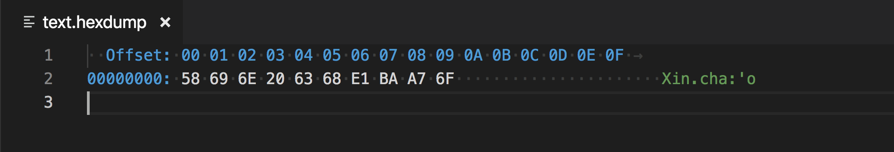

# String in Go

## `len` function

> len is a universal function to find length of any data type, it’s not particular to strings. We will learn about more Go’s built-in functions in upcoming tutorials.

## `rune`

> https://golang.org/doc/go1#rune
> Rune is a Type.
> It occupies 32bit and is meant to represent a Unicode CodePoint.

## Analyze `Xin chầo`



- Convert hexa `E1BAA7` to binary is `11100001.10111010.10100111`
- Convert `11100001.10111010.10100111` to code point (char code) ~~111~~00001.~~10~~111010.~~10~~100111 => 1111010100111
- `1111010100111` => 7847 => 1EA7

```go
r := []rune("ầ")
fmt.Printf("\n%x", r[0])
fmt.Printf("\n%v", r[0])
```
> https://play.golang.org/p/SzW4eKZNlkW

```js
console.log("ầ".charCodeAt(0))
```

## UTF-8

| Number of bytes | Bits for code point | Firstcode point | Lastcode point | Byte 1   | Byte 2   | Byte 3   | Byte 4   |
|----------------|--------------------|-----------------|----------------|----------|----------|----------|----------|
| 1              | 7                  | U+0000          | U+007F         | 0xxxxxxx |          |          |          |
| 2              | 11                 | U+0080          | U+07FF         | 110xxxxx | 10xxxxxx | 10xxxxxx |          |
| 3              | 16                 | U+0800          | U+FFFF         | 1110xxxx | 10xxxxxx | 10xxxxxx |          |
| 4              | 21                 | U+10000         | U+10FFFF       | 11110xxx | 10xxxxxx | 10xxxxxx | 10xxxxxx |

